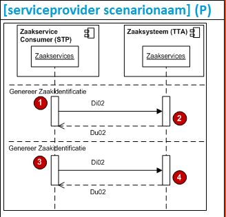

# Compliancy Wabo-BAG Services

|   |   |
| --- | --- |
| Testsetversie: | 1.1 |
| Status | In gebruik |
| Datum laatst gewijzigd | 19 mei 2015 |

## Revisie historie

| Versie | Datum | Reden en aard wijziging |
| --- | --- | --- |
| 1.0 | 08-09-2014 | Aanpassingen gemaakt naar aanleiding van feedback. |
| 1.1 | 25-11-2014 | Correctief onderhoud; Herindeling en naamswijziging testscenario’s t.b.v. StUF Testplatform release 1.3.0 |
| 1.2 | 19-05-2015 | Publicatie testsetbeschrijving op de gemmaonline. |

## Inleiding
De standaard [Wabo-BAG Services 1.0](documenten/Koppelvlakspecificatie_Wabo_Bag_v1.03.pdf) is op 4 juni 2014 formeel vastgesteld door de StUF Regiegroep. Daarmee heeft de standaard de status ‘In gebruik’ en wordt gemeenten aanbevolen om deze standaard te gebruiken.

Voor een juiste toepassing van de standaard Wabo-BAG Services worden door VNG Realisatie compliancy instrumenten ontwikkeld met als doel interoperabiliteitsproblemen tussen applicaties bij gemeenten preventief te verminderen. In de paragraaf 2.1 ”Wanneer is een softwareproduct compliant” is aangegeven wanneer een softwareproduct compliant is aan de Wabo-BAG Services 1.0.

<!--VNG Realisatie adviseert gemeenten bij aanschaf van software die moet voldoen aan deze standaard gebruik te maken van de [Handreiking Levering en Acceptatievoorwaarden ICT](https://vng-realisatie.github.io/Wabo-BAG-Services/documenten/130131_Leverings_en_acceptatievoorwaarden_versie_2_Definitief.pdf). Daarin zijn voorwaarden opgenomen over het gebruik van compliancy instrumenten.-->

Op 14 oktober 2014 heeft VNG Realisatie de technische professionals van leveranciers tekst en uitleg gegeven over het deze testset en het gebruik van het StUF Testplatform. Onderliggend document maakt deel uit van de compliancy instrumenten van VNG Realisatie.

## Doel van document
Doel van dit document is het definiëren van een standaard testset voor het testen van koppelingen die gebaseerd zijn op de Wabo-BAG Services 1.0. Deze testset beschrijft de tests die minimaal voorafgaand aan het in productie nemen van (aangepaste of nieuwe) software door de betreffende softwareleverancier uitgevoerd moeten worden.

De testen dienen uitgevoerd te worden conform deze beschrijving en met behulp en conform de voorwaarden van het StUF Testplatform. Voor gebruik van deze testset is een abonnement nodig op het StUF Testplatform nodig. Organisaties dienen zich, voor zover ze nog geen abonnement hebben, aan te melden. Zie: [StUF Testplatform](http://www.stuftestplatform.nl).

Indien voldaan wordt aan alle compliancy eisen uit kan de betreffende leverancier aangeven dat het geteste softwareproduct compliant is aan de Wabo-BAG Services 1.0.

## Wanneer is een softwareproduct compliant
Een softwareproduct is compliant aan de Wabo-BAG Services 1.0 (*), indien aan alle onderstaande vijf eisen wordt voldaan:

| Nr  | Eis |
|---- |---- |
| 1	  | Het betreffende softwareproduct getest is conform de eisen en voorwaarden uit onderliggende document inclusief de bijlagen en |
| 2	  | De uitvoering heeft plaatsgevonden op en conform de voorwaarden van het StUF testplatform en |
| 3	  | Een foutloos testresultaat is behaald en |
| 4	  | Finale en authentieke testrapporten openbaar zijn gemaakt op het internet en |
| 5	  | In de [GEMMA softwarecatalogus](https://www.softwarecatalogus.nl/) heeft u het authentieke testrapport uit stap 4 gepubliceerd bij het betreffende softwareproduct en aangegeven (aangevinkt) dat u compliant bent. |

(*) Hoewel een foutloos testresultaat van deze testset geen absolute zekerheid geeft van 100% interoperabiliteit tussen applicaties, geeft dit wel een goede indicatie van de kwaliteit van de ondersteuning van de standaard.

## Specificatie van testset
Leveranciers van gemeentelijke software dienen koppelingen te leveren die volledig voldoen aan de standaard. Afhankelijk van de GEMMA referentiecomponent(en) die een softwareproduct invult binnen het toepassingsgebied van de standaard, stelt de standaard andere eisen. Daardoor is de testscope niet voor alle applicaties gelijk.

## Referentiecomponenten
De specificatie beschrijft services voor de volgende referentiecomponenten. Dit zijn:

* Vergunningen, o.a Wabo
* BAG administratie

## Procesinteracties en systeemcomponenten
Onderstaand overzicht beschrijft het applicatielandschap met de te standaardiseren proces- en systeeminteracties. De interacties met een grijs bolletje en een B erin zijn buiten scope geplaatst.

## Consumer en provider testen
Bij elke test is middels een P of C aangegeven of het een Provider of Consumer test betreft. Bij een provider test moet de te testen applicatie een service beschikbaar stellen aan het StUF Testplatform; het StUF Testplatform zal één of meerdere berichten versturen naar de te testen applicatie. In geval van een consumer test levert het StUF Testplatform een service aan de te testen applicatie. De te testen applicatie moet in deze gevallen één of meerdere berichten versturen naar het StUF Testplatform. Afhankelijk of een test een provider of consumer test is verwacht het StUF Testplatform dus een bericht van de te testen applicatie of verstuurt het StUF Testplatform een bericht naar de te testen applicatie.

In de volgende paragrafen wordt per referentiecomponent/rol(*) beschreven welke testen uitgevoerd moeten worden, de testscope. Indien een softwareproduct invulling geeft aan meerdere referentiecomponenten dan is de testscope voor het softwareproduct gelijk aan de gezamenlijke testscope van alle ingevulde referentiecomponenten. Bijvoorbeeld, als een softwareproduct zowel de functionaliteit levert van de referentiecomponent Zaaksysteem als van een Document Management systeem, dan dienen zowel de testen van het referentiecomponent Zaaksysteem als Document Management systeem uitgevoerd te worden.

*Een rol kan gezien worden als een groep van referentiecomponenten die dezelfde generieke functionaliteit bieden. Een voorbeeld hiervan is de Zaakservice consumer. Indien een softwareproduct de rol van Zaakservice consumer invult dan betekent dit dat in dit softwareproduct zaakgerelateerde informatie ontstaat of wordt aangepast en dat deze informatie volgens de services uit de Zaak- en Documentservices wordt ontsloten naar een Zaaksysteem. Vrijwel elk softwareproduct kan de rol van Zaakservice consumer invullen. Denk aan vergunningsystemen, handhavingssystemen, uitkeringensysteem etc.

## Testscope Vergunningen
Indien een softwareproduct invulling geeft aan de referentiecomponent Vergunningen, dan moet op het StUF Testplatform de testset WABO-BAG uitgevoerd worden voor de referentiecomponent Vergunningen.

Tijdens de testset uitvoering mogen geen fouten geconstateerd worden door het StUF Testplatform.

Tijdens de testuitvoering simuleert het StUF Testplatform een Gegevensmagazijn/BAG applicatie. Er worden berichten naar het softwareproduct gestuurd waarin zowel verplichte als optionele elementen voorkomen. Tijdens de testuitvoering worden de volgende services getest:

1. Ad Hoc bevragingen BAG-Objecten (C)
2. Aanvraagnotificatie (C)
3. Statusnotificatie (C)
4. Toezichtnotificatie (C)
5. ObjectenBijOnderdeel (P)

## Testscope BAG
Indien een softwareproduct invulling geeft aan de referentiecomponent BAG, dan moet op het StUF Testplatform de testset WABO-BAG uitgevoerd worden voor de referentiecomponent BAG-administratie.

Tijdens de testset uitvoering mogen geen fouten geconstateerd worden door het StUF Testplatform.

Tijdens de testuitvoering simuleert het StUF Testplatform een Vergunningen systeem. Er worden berichten naar het te testen softwareproduct gestuurd waarin zowel verplichte als optionele elementen voorkomen. Tijdens de testuitvoering worden de volgende services getest:

1. Ad Hoc bevragingen BAG-Objecten (P)
2. Aanvraagnotificatie (P)
3. Statusnotificatie (P)
4. Toezichtnotificatie (P)
5. ObjectenBijOnderdeel (C)

Indien het te testen softwareproduct services ondersteunt die onderdeel uitmaken van de Zaak- en Documentservices dan vervult de te testen applicatie de rol van Document- of Zaakservice consumer vanuit de context van de Zaak- en Documentservices standaard. In dit geval moet de te testen applicatie ook voldoen aan de eisen van een Document- of Zaakservice consumer zoals beschreven in de Zaak- en Documentservices testset.

## Testscope Gegevensmagazijn
Indien een softwareproduct invulling geeft aan de referentiecomponent BAG, dan moet op het StUF Testplatform de testset WABO-BAG uitgevoerd worden voor de referentiecomponent Gegevensmagazijn.

Tijdens de testuitvoering simuleert het StUF Testplatform een Vergunningen systeem. Er worden berichten naar het te testen softwareproduct gestuurd waarin zowel verplichte als optionele elementen voorkomen. Tijdens de testuitvoering worden de volgende service getest:

* Ad Hoc bevragingen BAG-Objecten (P)

## Beschrijving testset scenario’s
De testscenario’s behorende bij deze testset zijn beschreven in een [spreadsheet](documenten/Testset_Wabo_Bag_Services_1.0_v1.1.zip).

Per referentiecomponent/rol is een tabblad opgenomen waar u de testscenario’s vindt die relevant zijn voor softwareproducten die deze referentiecomponent/rol invullen. Een testscenario beschrijving bestaat uit een sequence diagram (in UML) en een tabel waarin wordt toegelicht welke acties uitgevoerd moeten worden en wat daarbij het resultaat moet zijn.

Het sequence diagram geeft aan in welke volgorde de berichten verstuurd moeten worden door het StUF Testplatform of de te testen applicatie. De rode bolletjes geven de scenariostappen weer.

## Gebruik van het StUF Testplatform
Het StUF Testplatform is een onafhankelijk en formeel toetsinginstrument voor het testen van koppelingen gebaseerd op standaarden uit de StUF familie. Het platform is vanaf eind 2011 in productie en wordt beheerd en doorontwikkeld door VNG Realisatie.

Primair is het StUF Testplatform voor ICT softwareleveranciers die werkzaam zijn op de gemeentelijke markt. Zij kunnen vroegtijdig tijdens de ontwikkeling van software testen of applicatie-applicatiekoppelingen voldoen aan StUF. Leveranciers worden geacht een (preventieve) test uit te voeren op het StUF Testplatform voordat een softwareproduct in productie wordt genomen.

In de [handleiding StUF Testplatform](./documenten/Gebruikershandleiding_StUF_Testplatform.pdf) wordt verder toegelicht hoe het testplatform gebruikt kan worden.
